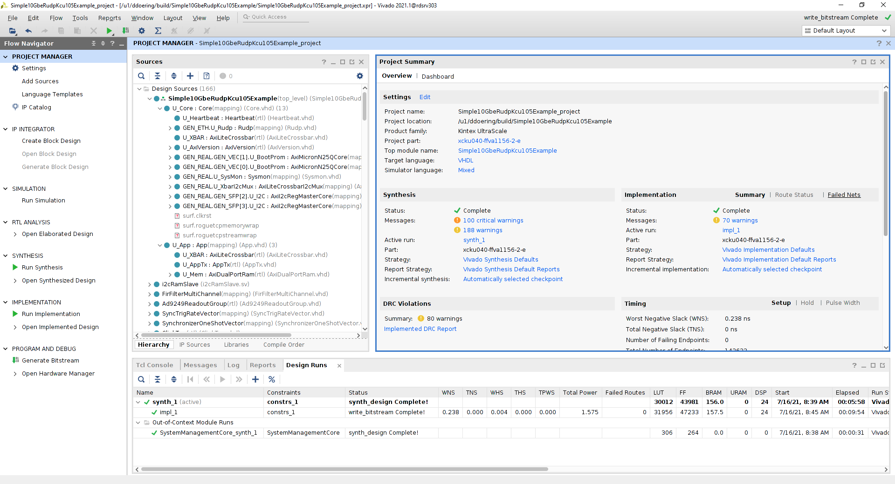

# Simple-10GbE-RUDP-KCU105-Example

<!--- ########################################################################################### -->

# Before you clone the GIT repository

1) Create a github account:
> https://github.com/

2) On the Linux machine that you will clone the github from, generate a SSH key (if not already done)
> https://help.github.com/articles/generating-a-new-ssh-key-and-adding-it-to-the-ssh-agent/

3) Add a new SSH key to your GitHub account
> https://help.github.com/articles/adding-a-new-ssh-key-to-your-github-account/

4) Setup for large filesystems on github

```bash
$ git lfs install
```

5) Verify that you have git version 2.13.0 (or later) installed 

```bash
$ git version
git version 2.13.0
```

6) Verify that you have git-lfs version 2.1.1 (or later) installed 

```bash
$ git-lfs version
git-lfs/2.1.1
```

<!--- ########################################################################################### -->

# Clone the GIT repository

```bash
$ git clone --recursive git@github.com:slaclab/Simple-10GbE-RUDP-KCU105-Example
```

<!--- ########################################################################################### -->

# How to build the firmware 

1) Setup Xilinx licensing

> If you are on the SLAC network, here's how to setup the Xilinx licensing
  
```bash
$ source Simple-10GbE-RUDP-KCU105-Example/firmware/setup_env_slac.sh
```

> Else you will need to install Vivado and install the Xilinx Licensing

2) Go to the target directory and build the firmware via `make`:

```bash
$ cd Simple-10GbE-RUDP-KCU105-Example/firmware/targets/Simple10GbeRudpKcu105Example
$ make
```

3) Optional: Review the results in GUI mode
```bash
$ make gui
```



<!--- ########################################################################################### -->

# How to install the Rogue With Anaconda

> https://slaclab.github.io/rogue/installing/anaconda.html

<!--- ########################################################################################### -->

# How to run the Software Development GUI with KCU105 Hardware

```bash
# Make sure that you have jumbo frames enabled on your network interface:
# Example for network interface being eth2
$ sudo ifconfig eth2 mtu 9000

# Go to software directory
$ cd Simple-10GbE-RUDP-KCU105-Example/software

# Setup conda environment
$ source /path/to/my/anaconda3/etc/profile.d/conda.sh

# Activate Rogue conda Environment (refer to "How to install the Rogue With Anacond section")
$ conda activate rogue_v5.8.0

# Launch the GUI in RUDP mode
$ python scripts/devGui.py
```

<!--- ########################################################################################### -->

# How to run the Software Development with VCS firmware simulator

1) Start up two terminal

2) In the 1st terminal, launch the VCS simulation (assuming on SLAC AFS network)
```bash
# Source the firmware/setup_env_slac.sh, which includes both Vivado and VCS
$ source Simple-10GbE-RUDP-KCU105-Example/firmware/setup_env_slac.sh

# Go to the target directory and execute the `vcs` build
$ cd Simple-10GbE-RUDP-KCU105-Example/firmware/targets/Simple10GbeRudpKcu105Example
$ make vcs

# Go to the VCS build output
$ cd ../../build/Simple10GbeRudpKcu105Example/Simple10GbeRudpKcu105Example_project.sim/sim_1/behav/

# Source the VCS + VHPI environment setup
$ source setup_env.sh

# Compile firmware with VCS 
$ ./sim_vcs_mx.sh

# Launch the VCS GUI (either DVE or VERDI)
$ ./simv -gui=dve & (or $ ./simv -gui=verdi -verdi_opts -sx &)
```

3) When the VCS GUI pops up, start the simulation run

4) In the 2nd terminal, launch the GUI in simulation mode
```bash
# Go to software directory
$ cd Simple-10GbE-RUDP-KCU105-Example/software

# Setup conda environment
$ source /path/to/my/anaconda3/etc/profile.d/conda.sh

# Activate Rogue conda Environment (refer to "How to install the Rogue With Anacond section")
$ conda activate rogue_v5.8.0

# Launch the GUI in RUDP mode
$ python scripts/devGui.py --ip sim
```

<!--- ########################################################################################### -->

# How to reprogram your KCU105 board's QSPI Boot Prom

> Note: The Board `MUST` be loaded with the Simple10GbeRudpKcu105Example firmware 
> before you can use this remote PROM reprogramming script.

Make sure you have the SW15 switch setup for QSPI booting:


```bash
# Go to software directory
$ cd Simple-10GbE-RUDP-KCU105-Example/software

# Setup conda environment
$ source /path/to/my/anaconda3/etc/profile.d/conda.sh

# Activate Rogue conda Environment (refer to "How to install the Rogue With Anacond section")
$ conda activate rogue_v5.8.0

# Run the reprogramming script
$ python scripts/updateBootProm.py --path ../firmware/targets/Simple10GbeRudpKcu105Example/images/
```

<!--- ########################################################################################### -->
