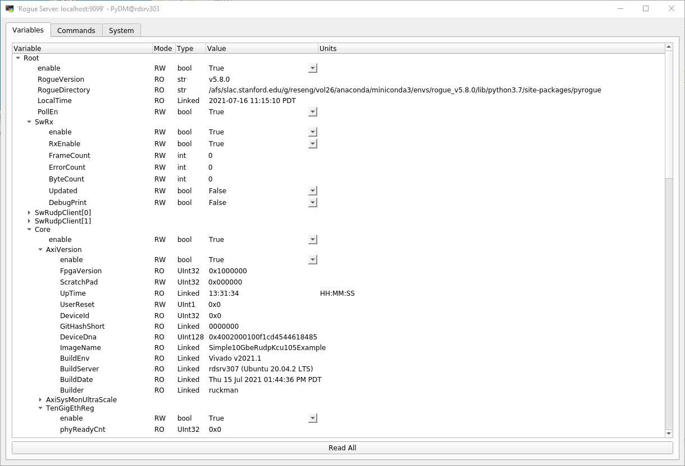

.. _how_to_simulation:

===================================================================
How to run the Software Development GUI with VCS firmware simulator
===================================================================

1) Start up two terminal

In the first terminal
=====================

1) Setup Vivado and VCS (refer to :ref:`requirements_vivado_setup`)

2) Go to the target directory and execute the `vcs` build

.. code-block:: bash

   $ cd Simple-10GbE-RUDP-KCU105-Example/firmware/targets/Simple10GbeRudpKcu105Example
   $ make vcs

3) Go to the VCS build output

.. code-block:: bash

   $ cd ../../build/Simple10GbeRudpKcu105Example/Simple10GbeRudpKcu105Example_project.sim/sim_1/behav/

4) Source the VCS + VHPI environment setup

.. code-block:: bash

   $ source setup_env.sh

5) Compile firmware with VCS 

.. code-block:: bash

   $ ./sim_vcs_mx.sh

6) Launch the VCS GUI (either DVE or VERDI)

.. code-block:: bash

   $ ./simv -gui=dve & (or $ ./simv -gui=verdi -verdi_opts -sx &)

7) When the VCS GUI pops up, start the simulation run

In the Second terminal
======================

8) Setup rogue software (refer to :ref:`requirements_rogue_setup`)

9) run the Development GUI python script with **--ip sim** argument

.. code-block:: bash

   $ cd Simple-10GbE-RUDP-KCU105-Example/software
   $ python scripts/devGui.py --ip sim
