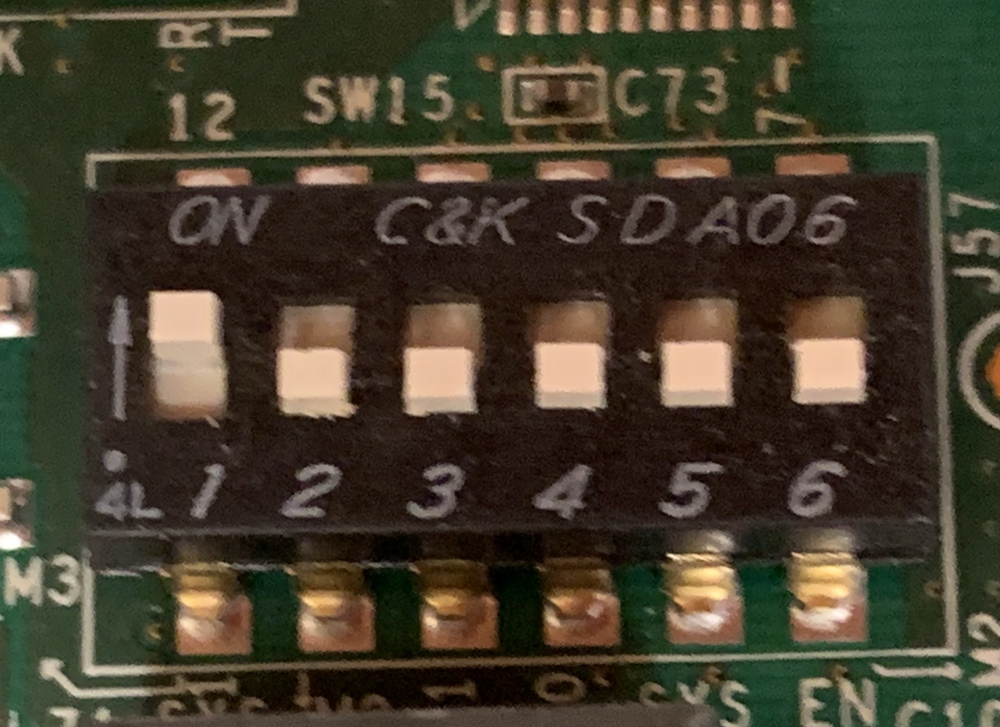

.. _setup_hardware_setup:

==============
Hardware Setup
==============

This section describes the required hardware and host system configuration
needed to bring up the KCU105 development platform.

Required Hardware
-----------------

You will need the following hardware components:

KCU105 Development Board
~~~~~~~~~~~~~~~~~~~~~~~~

One Xilinx KCU105 development board is required:

   https://www.xilinx.com/products/boards-and-kits/kcu105.html

10GbE SFP+ Transceiver
~~~~~~~~~~~~~~~~~~~~~

You will need a 10GbE SFP+ transceiver compatible with the KCU105 board.
An example of a suitable transceiver is:

   https://www.fs.com/products/74668.html

Fiber Optic Cable
~~~~~~~~~~~~~~~~~

A fiber optic cable compatible with the selected SFP+ transceivers is required.
For example:

   https://www.fs.com/products/40180.html

Host System 10GbE Network Interface
~~~~~~~~~~~~~~~~~~~~~~~~~~~~~~~~~~

A host machine equipped with a 10GbE network interface card (NIC) is required
to communicate with the KCU105 over the SFP+ link.

A low-cost and commonly available option is a Broadcom BCM57810S–based dual-port
10GbE SFP+ PCIe NIC, for example:

   https://www.amazon.com/Ethernet-Broadcom-BCM57810S-Controller-Interface/dp/B06X9T683K

This NIC supports SFP+ transceivers and is widely supported by Linux kernel
drivers, making it a good and inexpensive choice for development and testing.

Micro USB Cable
~~~~~~~~~~~~~~~

A micro USB cable is required for initial firmware programming using the
JTAG-to-USB connector on the KCU105 board.

Board Configuration
-------------------

QSPI Boot Mode Selection
~~~~~~~~~~~~~~~~~~~~~~~~

For booting the KCU105 via the QSPI PROM, configure the SW15 switch with
position #1 set in the arrow direction.

KCU105 Hardware Overview
~~~~~~~~~~~~~~~~~~~~~~~~

The following image shows the KCU105 hardware layout:

.. image:: ../../images/kcu105_hw.png
  :width: 800
  :alt: KCU105 hardware overview

Initial Firmware Programming
----------------------------

The KCU105 must be programmed via JTAG the first time before it can boot
from the QSPI PROM.

Use the JTAG-to-USB connector on the board and follow the instructions
provided in the SLAC firmware programming guide:

   https://docs.google.com/presentation/d/1ANiM92PP5BN3exUhUnahFOepXYiiALVsTczf8t8YVJ0/edit?usp=sharing

Host System Configuration for SFP+ Transceivers
-----------------------------------------------

Some 10GbE NICs may restrict the use of non-vendor-qualified SFP+ transceivers
by default. On Linux systems, this restriction can be overridden by updating
the GRUB configuration.

Edit the GRUB configuration file:

.. code-block:: bash

   root@ubuntu:~# nano /etc/default/grub

Update the kernel command line parameters as follows:

.. code-block:: bash

   GRUB_CMDLINE_LINUX_DEFAULT=""
   GRUB_CMDLINE_LINUX="ixgbe.allow_unsupported_sfp=1"

Apply the updated GRUB configuration:

.. code-block:: bash

   root@ubuntu:~# update-grub

Reboot the system for the changes to take effect:

.. code-block:: bash

   root@ubuntu:~# reboot

After rebooting, verify that the SFP+ transceiver is detected correctly by
the network interface before proceeding with further setup.
