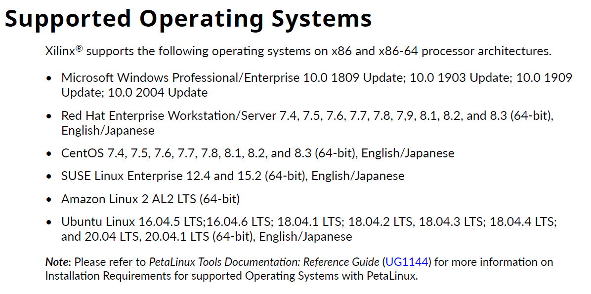

.. _setup_supported_os:

==============
Supported Operating Systems
==============

Make sure you are running in an OS that can run Vivavo:

Optional: if you want more details about Vivado installation requirements:

https://www.xilinx.com/support/documentation/sw_manuals/xilinx2021_1/ug973-vivado-release-notes-install-license.pdf
